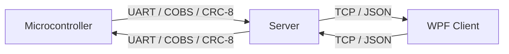

# Communication Game System

A rehabilitation pressure game system with microcontroller, server bridge, and game client.

## Architecture

## Projects

### Full System (CommunicationGameSystem.sln)
- **Server** — WPF server with UART↔TCP bridge, game authority, configuration UI
- **Client** — WPF game client with modern UI, pause/resume/restart
- **Shared** — Common DTOs, enums, protocol constants

### Client-Only Distribution (CommunicationGameSystem.Client-Only.sln)
- **Client** — Game client only
- **Shared** — Required shared library
- distributing to players

## Building

**Requirements:**
- .NET 8 SDK
- Visual Studio 2022 (or Rider/VS Code with C# DevKit)

**Steps:**
1. Open `CommunicationGameSystem.sln` (full) or `CommunicationGameSystem.Client-Only.sln` (client only)
2. Build → Build Solution
3. Run Server first, then Client

## Running the Server

1. Start `CommunicationGame.Server.exe` (**Not implemented yet.** Use `CommunicationGameSystem.sln`)
2. Configure:
   - **COM Port:** Select your virtual COM port (from Proteus COMPIM)
   - **Baud Rate:** 9600 (default)
   - **TCP Port:** 5000 (default)
3. Click **Start Server**
4. Monitor UART/TCP/Game status in the UI

## Running the Client

1. Ensure the server is running **and the MCU/UART is connected** first
2. Start `CommunicationGame.Client.Wpf.exe` (**Not implemented yet.** Use `CommunicationGameSystem.Client-Only.sln`)
3. Enter server **Host** (127.0.0.1 for local) and **Port** (5000)
4. Click **Connect**
5. The game starts **only when all links are ready** — the UART/MCU must be
   connected on the server side. If it isn't, the server replies with a
   `NOT_READY` error instead of starting; connect the MCU and reconnect.
6. Use **Pause**, **Resume**, **Restart** buttons as needed

> **Start ordering:** power up / connect the microcontroller, start the server
> and confirm UART shows **Connected**, then connect the client. The game will
> not begin until every connection in the chain is established.

## Game Rules

- **Green Zone:** Pressure between 40–70
- **Win:** Accumulate 30 seconds in green zone
- **Lose:** 3 consecutive seconds outside green zone
- Pause/Resume preserves timer state
- Restart creates a new game session

## Microcontroller

The microcontroller code is in `microContorller_side/microContorller_side/main.cpp`.

**Target:** ATmega32 @ 8 MHz  
**Protocol:** UART 9600 baud, COBS framing, CRC-8 validation  
**Simulation:** Proteus with COMPIM virtual COM port

## Protocol Documentation

See `docs/protocol-design.md` for full UART and TCP protocol specifications.

## Troubleshooting

**"No connection could be made because the target machine actively refused it"**
- Ensure the server is running first
- Check that TCP port matches (default 5000)
- Verify firewall isn't blocking the connection

**UART stuck on "Handshaking" (MCU keeps sending HELLO):**
- This was caused by the firmware losing received bytes during `_delay_ms()`
  calls (the ATmega32 has only a 2-byte hardware UART buffer). The firmware now
  uses an **interrupt-driven receive ring buffer**, so the server's WELCOME is
  no longer dropped and the handshake completes.
- Also check COM port selection, Proteus COMPIM wiring, and baud rate (9600).

**Game won't start / "NOT_READY" error:**
- By design, the game starts only when all connections are made. Ensure the
  server shows UART **Connected** before connecting the client.

**Logs appearing:**
- Click "Open Full Log" for detailed history.

---

**License:** Educational/University project  
**Author:** Keivanzadeh  
**Course:** Communication Systems In Medicine
