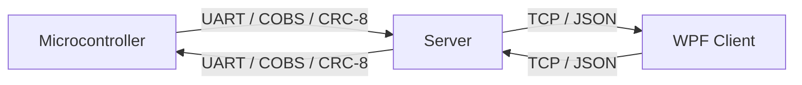
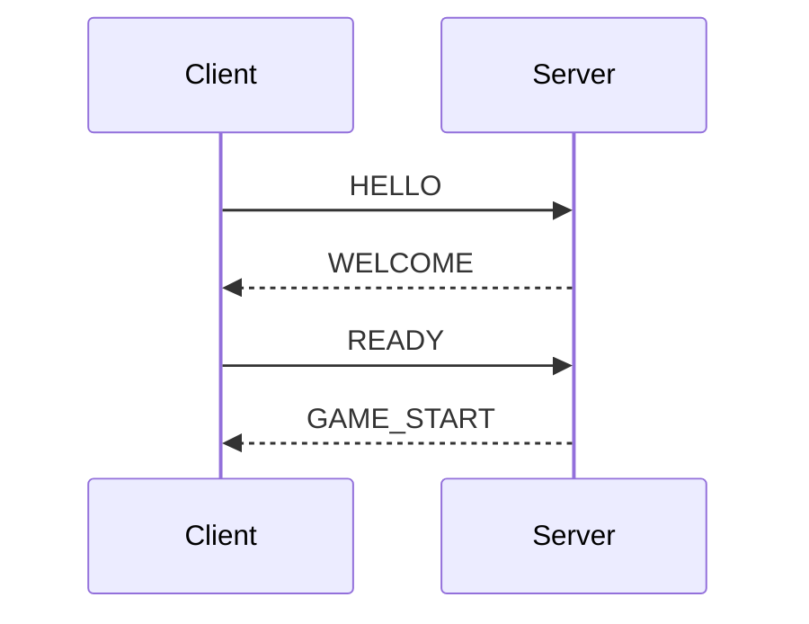
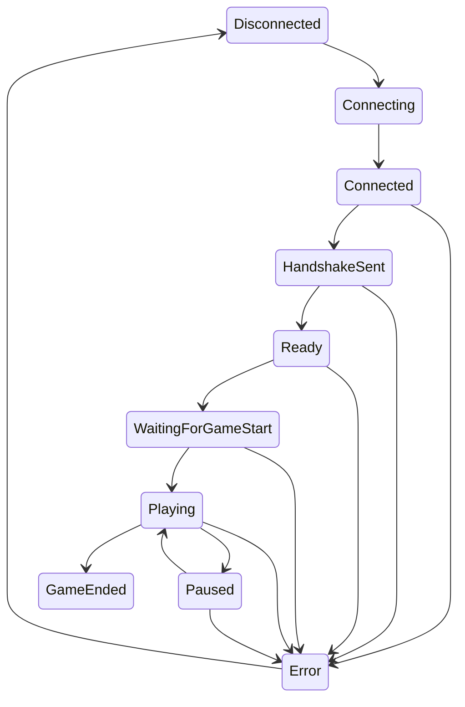

# Protocol Design Document
## Communication Game System

**Version:** 1.1
**Date:** 2026-06-27

---

## 1. System Overview



The server is the central authority. It bridges two distinct protocols:
- **UART side:** Binary packets with COBS framing and CRC-8 integrity
- **TCP side:** Newline-delimited JSON messages

---

## 2. UART Protocol (MCU ↔ Server)

### 2.1 Physical Layer
- Baud rate: 9600
- Data bits: 8, Parity: None, Stop bits: 1 (8N1)
- Connection: USB Virtual COM (Proteus COMPIM)

### 2.2 Packet Structure (before COBS encoding)

| Offset | Size | Field   | Description                    |
|--------|------|---------|--------------------------------|
| 0      | 1    | TYPE    | Packet type (see section 2.3)  |
| 1      | 1    | SEQ     | Sequence number (0-255, wraps) |
| 2      | 1    | LEN     | Payload length in bytes        |
| 3..N   | LEN  | PAYLOAD | Type-specific data             |
| 3+LEN  | 1    | CRC8    | CRC-8 over bytes 0..(2+LEN)    |

### 2.3 Packet Types

| Value | Name         | Direction    | Payload | Description              |
|-------|-------------|-------------|---------|--------------------------|
| 0x01  | HELLO       | Both        | None    | Initiate handshake       |
| 0x02  | WELCOME     | Server→MCU  | None    | Handshake acknowledgment |
| 0x03  | READY       | MCU→Server  | None    | Handshake complete       |
| 0x04  | START_STREAM| Server→MCU  | None    | Begin sending data       |
| 0x05  | STOP_STREAM | Server→MCU  | None    | Stop sending data        |
| 0x06  | DATA        | MCU→Server  | 1 byte  | Pressure value (0-100)   |
| 0x07  | PING        | Server→MCU  | None    | Heartbeat request        |
| 0x08  | PONG        | MCU→Server  | None    | Heartbeat response       |
| 0x09  | ERROR       | Both        | None    | Error notification       |
| 0x0A  | ACK         | Both        | None    | Generic acknowledgment   |

### 2.4 COBS Framing

All packets are COBS-encoded before transmission. COBS ensures no 0x00 bytes
appear in the encoded data, allowing 0x00 to serve as the frame delimiter.

Wire format: `[COBS-encoded packet bytes] [0x00]`

### 2.5 CRC-8

- Polynomial: 0x07 (x⁸ + x² + x + 1)
- Initial value: 0x00
- Computed over TYPE + SEQ + LEN + PAYLOAD bytes (all except CRC field itself)

### 2.6 UART State Machine

```
DISCONNECTED ──(send HELLO)──→ HANDSHAKING
HANDSHAKING  ──(recv WELCOME/HELLO + send READY)──→ CONNECTED
CONNECTED    ──(recv START_STREAM)──→ STREAMING
STREAMING    ──(recv STOP_STREAM)──→ CONNECTED
Any          ──(error/timeout)──→ ERROR → DISCONNECTED
```

> **Implementation requirement (firmware RX):** The ATmega32 USART has only a
> 2-byte hardware receive buffer. The MCU main loop uses blocking `_delay_ms()`
> calls during which it cannot poll the UART, so a multi-byte server frame (e.g.
> WELCOME) arriving during a delay would overrun and be lost — leaving the MCU
> stuck in HANDSHAKING and resending HELLO indefinitely. The firmware therefore
> **must** receive bytes via the USART RX-complete interrupt (`USART_RXC_vect`,
> `RXCIE` enabled, `sei()`) into a ring buffer that the main loop drains. This
> decouples reception from main-loop timing and is required for a reliable
> handshake and for receiving PING/START_STREAM/STOP_STREAM during gameplay.

---

## 3. TCP Protocol (Server ↔ Client)

### 3.1 Transport
- TCP on port 5000 (configurable)
- Newline-delimited JSON (`\n` terminated)
- UTF-8 encoding

### 3.2 Message Structure

All messages share a common envelope:
```json
{
  "type": "MESSAGE_TYPE",
  "timestamp": 1719187200000,
  ...type-specific fields
}
```

### 3.3 Message Types

| Type            | Direction     | Key Fields                                | Description             |
|-----------------|----------------|-------------------------------------------|-------------------------|
| HELLO           | Client→Server  | version                                   | Client initiates        |
| WELCOME         | Server→Client  | version, session_id                       | Server responds         |
| READY           | Client→Server  | —                                         | Client ready to play    |
| GAME_START      | Server→Client  | session_id                                | Game begins             |
| PRESSURE_DATA   | Server→Client  | pressure, in_green, green_accum,red_consec| Live game data          |
| GAME_END        | Server→Client  | result, reason                            | Game finished           |
| PAUSE_REQUEST   | Client→Server  | —                                         | Request pause           |
| PAUSE_ACK       | Server→Client  | —                                         | Pause confirmed         |
| RESUME_REQUEST  | Client→Server  | —                                         | Request resume          |
| RESUME_ACK      | Server→Client  | —                                         | Resume confirmed        |
| RESTART_REQUEST | Client→Server  | —                                         | Request new game        |
| RESTART_ACK     | Server→Client  | session_id                                | New session created     |
| HEARTBEAT_PING  | Server→Client  | —                                         | Keep-alive ping         |
| HEARTBEAT_PONG  | Client→Server  | —                                         | Keep-alive response     |
| ERROR           | Server→Client  | error_code, message                       | Error notification      |
| SERVER_SHUTDOWN | Server→Client  | message                                   | Clean shutdown notice   |

### 3.4 TCP Handshake Sequence


### 3.5 Client State Machine

---

## 4. Protocol Bridge (Server)

The server translates between UART binary and TCP JSON:

UART ↔ SERVER:
| UART Event         | Server Action                     | TCP Output              |
|--------------------|-----------------------------------|-------------------------|
| DATA packet        | Process game logic, compute timers| PRESSURE_DATA message   |
| Win/Lose detected  | End game, send STOP_STREAM        | GAME_END message        |
| ERROR/timeout      | End game, send STOP_STREAM        | ERROR + GAME_END        |
| MCU HELLO (reset)  | Re-handshake, end active game     | ERROR + GAME_END        |

CLIENT ↔ SERVER
| TCP Event          | Server Action                     | UART Output             |
|--------------------|-----------------------------------|-------------------------|
| READY received     | Start game only if all links ready| START_STREAM packet     |
| PAUSE_REQUEST      | Pause game                        | STOP_STREAM packet      |
| RESUME_REQUEST     | Resume game                       | START_STREAM packet     |
| RESTART_REQUEST    | New session, start game           | START_STREAM packet     |
| Client disconnect  | End game                          | STOP_STREAM packet      |

---

## 5. Game Rules

- **Green zone:** Pressure 40–70 (inclusive)
- **Win condition:** 30 cumulative seconds in green zone
- **Lose condition:** 3 consecutive seconds outside green zone
- Green timer accumulates (not consecutive)
- Red timer resets to 0 when entering green zone
- Server is authoritative; client mirrors display

---

## 6. Error Handling

### UART Errors
- CRC failure → log, discard packet
- COBS decode failure → log, discard packet
- Invalid pressure (>100) → log, do not forward
- Heartbeat timeout (3 missed PONGs) → ERROR state, end game

### TCP Errors
- Invalid JSON → log, send ERROR if recoverable
- Client heartbeat timeout → disconnect, end game
- Unexpected message for state → log, ignore or send ERROR

### Recovery
- UART disconnect: stop game, notify client, attempt reconnect
- Client disconnect: stop streaming, reset session, wait for new client
- MCU reset: re-handshake, end active game, notify client

---

## 7. Heartbeat

- **UART:** Server sends PING every 3s, expects PONG within 10s
- **TCP:** Server sends HEARTBEAT_PING every 3s, expects HEARTBEAT_PONG
- 3 missed responses → timeout → error handling

---

## 8. Start Gating (all connections required)

The game session transitions `Idle → Running` (on `READY`, or on
`RESTART_REQUEST` from `Ended`/`Error`) **only when every link in the chain is
established**:

- UART/MCU is `Connected` or `Streaming`, **and**
- a TCP client is connected.

If these are not met, the server does **not** start the game and instead sends an
`ERROR` with code `NOT_READY`. This guarantees gameplay never begins against a
missing data source. Recommended start order: **MCU → Server (confirm UART
Connected) → Client**.

---

## 9. Revision Notes (v1.1, 2026-06-27)

- **Firmware RX reliability:** documented and implemented interrupt-driven UART
  reception (ring buffer) to fix the stuck-handshake bug (see section2.6).
- **Start gating:** game start/restart now requires all connections (see section8).
- **Client logging:** client log events are marshalled to the UI thread and live
  pressure data is logged (throttled) so the log window stays active during play.
